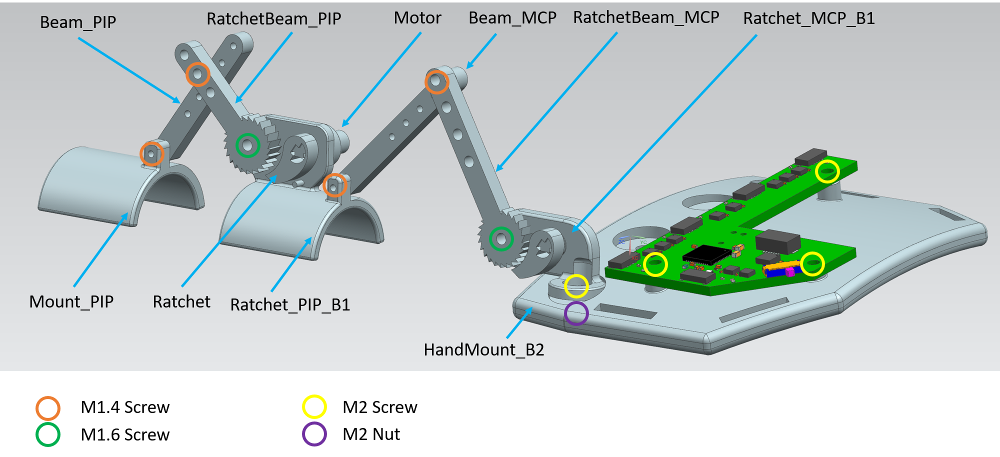

# DextrEMS: Increasing Dexterity in Electrical Muscle Stimulation by Combining it with Brakes

This is the repository for PCB schematics and 3D printed file used in the wearable device in the "DextrEMS: Increasing Dexterity in Electrical Muscle Stimulation by Combining it with Brakes" paper (ACM UIST2021).

## hardware

- 1x exoskeleton
- 1x electrical muscle stimulation with 8 channels (Rehastim3)

### hardware - exoskeleton

#### 3D Printed

- 1x HandMount_B2
- 3x Mount_PIP
- 3x Ratchet_PIP_B1
- 1x Mount_PIP_Pinky
- 1x Ratchet_PIP_Pinky
- 5x Ratchet_MCP_B1

#### Laser Cut (~3mm Acrylic)

- 5x ratchets_n_beams_v2.ai containing:
  - 1x Beam_PIP
  - 1x RatchetBeam_PIP
  - 1x Beam_MCP
  - 1x RatchetBeam_MCP
  - 2x Ratchet

#### Hardware

- 1x PCB_dextrEMS_v1
- 8x DC Motors (Vibration Motor 11.6×4.6×4.8mm, Pololu - [link](https://www.pololu.com/product/2265))
- 7x M2 Screws (4 for Ratchet_MCP and 3 for PCB)
- 16x M1.4 (for all links)
- 8x M1.6 (for all ratchet beams)
- Velcro straps (for finger and hand mounts)
- Strong glue (for bonding Velcro to 3D printed parts)
- Hot glue (optional if the ratchet and motors slide out)

## citing

When using or building upon this device in an academic publication, please consider citing as follows:

Romain Nith, Shan-Yuan Teng, Pengyu Li, Yujie Tao, Pedro Lopes. 2021. DextrEMS: Increasing Dexterity in Electrical Muscle Stimulation by Combining it with Brakes. In Proceedings of ACM Symposium on User Interface Software and Technology 2021 (UIST’2021). Association for Computing Machinery, New York, NY, USA. https://doi.org/10.1145/3472749.3474759

### contact

For any questions about this repository, please contact rnith@uchicago.edu

